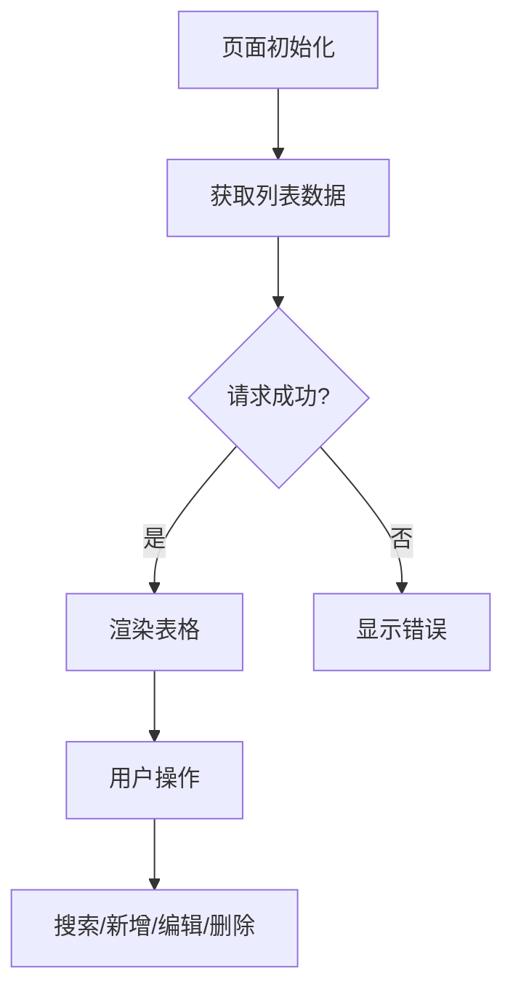

# 链路识别规则

## 链路分类

### 1. 初始化加载链路

识别标志：
- Vue: created, mounted, onMounted
- React: useEffect(() => {}, []), useLayoutEffect

链路步骤：
1. 组件创建/挂载
2. 初始化数据请求
3. 数据赋值
4. 视图渲染

示例描述格式：
```markdown
**链路名称**：页面初始化加载

**触发条件**：用户进入页面

**执行步骤**：
1. 组件挂载时触发 onMounted
2. 调用 getUserList 接口获取列表数据
3. 将数据赋值给 tableData
4. 表格组件重新渲染显示数据

**数据流转**：
- 初始状态：tableData = []
- 请求后：tableData = [...接口返回数据]
```

### 2. 主业务操作链路

识别标志：
- 按钮点击：@click, onClick
- 表单提交：@submit, onSubmit
- 搜索操作：搜索按钮点击

链路步骤：
1. 用户操作触发
2. 参数校验
3. 接口请求
4. 响应处理
5. 视图更新/跳转

示例描述格式：
```markdown
**链路名称**：用户搜索

**触发条件**：点击搜索按钮

**执行步骤**：
1. 点击搜索按钮触发 handleSearch
2. 校验搜索参数
3. 调用 getUserList 接口，传入搜索参数
4. 接口返回后更新 tableData
5. 表格重新渲染

**分支走向**：
- 成功：更新表格数据
- 失败：显示错误提示

**异常处理**：
- 接口超时：显示超时提示，支持重试
- 参数错误：显示校验错误信息
```

### 3. 分支跳转链路

识别标志：
- 路由跳转：router.push, navigate
- 弹窗打开：visible = true, setOpen(true)
- 抽屉打开：drawerVisible = true

示例描述格式：
```markdown
**链路名称**：新增用户

**触发条件**：点击新增按钮

**执行步骤**：
1. 点击新增按钮
2. 打开新增用户弹窗
3. 用户填写表单
4. 点击确认提交
5. 调用 createUser 接口
6. 成功后关闭弹窗，刷新列表

**跳转条件**：
- 有新增权限：可打开弹窗
- 无权限：显示无权限提示
```

### 4. 异常处理链路

识别标志：
- try-catch
- .catch()
- onError
- 错误边界

示例描述格式：
```markdown
**链路名称**：接口异常处理

**异常类型**：
- 网络错误
- 接口返回错误
- 权限不足

**处理方式**：
- 网络错误：显示网络异常提示，提供重试按钮
- 业务错误：显示后端返回的错误信息
- 权限不足：跳转到403页面

**容错降级**：
- 列表加载失败：显示空状态
- 详情加载失败：显示错误页面
```

## 链路依赖关系图示

使用 Mermaid 语法描述链路关系：


